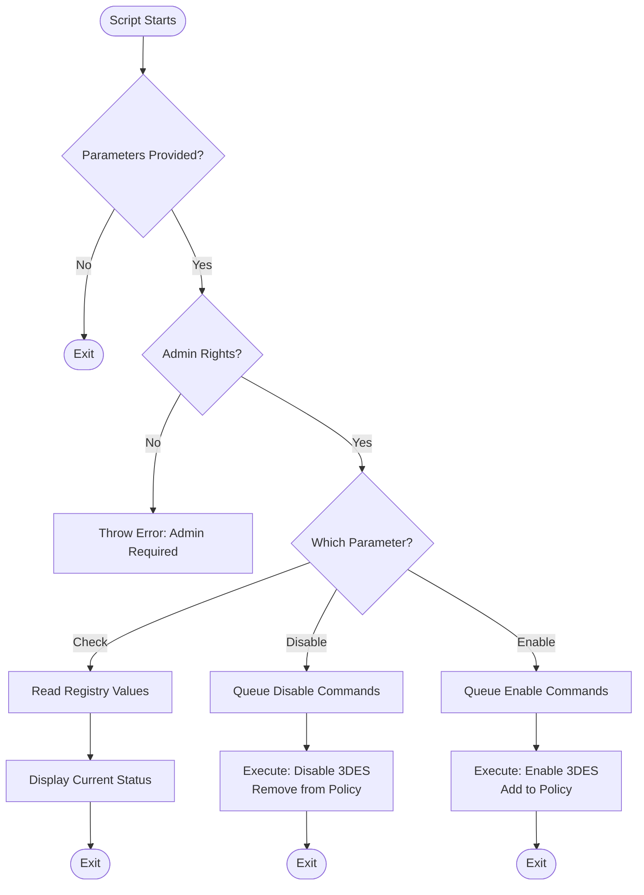

# Disable-LegacyBlockCiphers

## Description

`Disable-LegacyBlockCiphers.ps1` is a PowerShell script that manages legacy block ciphers by modifying registry settings. This script modifies registry settings to enable or disable legacy block ciphers such as DES, 3DES, IDEA, and RC2.

## Workflow



## Usage

The script supports the following parameters:

- `-Check`: Checks the current status of legacy block ciphers without making any changes.
- `-DisableLegacyBlockCiphers`: Disables legacy block ciphers.
- `-EnableLegacyBlockCiphers`: Enables legacy block ciphers.

## Example

```powershell
.\Disable-LegacyBlockCiphers.ps1 -DisableLegacyBlockCiphers
```

## Requirements

- Windows PowerShell 5.1 or later
- Administrative privileges

## Troubleshooting

If you receive an error that an execution policy has prevented the script from running, run the following command:

```powershell
Set-ExecutionPolicy -Scope Process -ExecutionPolicy Bypass
```

## Security Note

This script is designed to enhance system security by managing legacy block cipher settings. Always use caution when modifying system settings and ensure you have proper authorisation before running this script in a production environment.

