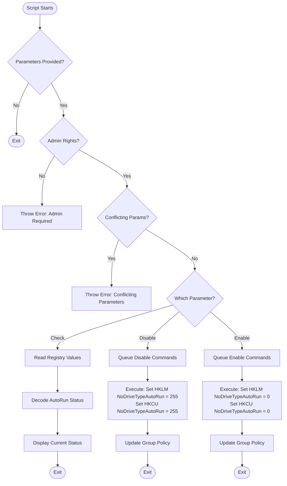

# Set-Autoplay

## Description
`Set-Autoplay.ps1` is a PowerShell script designed to manage Autoplay and Autorun settings on Windows 10 and Windows 11 systems. It provides functionality to enable or disable Autoplay and Autorun for all drives, as well as to check the current Autoplay and Autorun status.

## Workflow



## Key Features

- **Enable/Disable Autoplay and Autorun**: Allows enabling or disabling Autoplay and Autorun for all drives.
- **Check Status**: Check the current Autoplay and Autorun status without making any changes.
- **Logging**: Comprehensive logging of all operations for auditing and troubleshooting.
- **Error Handling**: Robust error handling and informative error messages.
- **Command Pattern**: Utilizes the Command design pattern for flexible and extensible Autoplay and Autorun management operations.

## Usage

The script supports the following parameters:

- `-Disable`: Disables Autoplay and Autorun.
- `-Enable`: Enables Autoplay and Autorun.
- `-Check`: Retrieves the current Autoplay and Autorun status.

## Example

```powershell
.\Set-Autoplay.ps1 -Disable

.\Set-Autoplay.ps1 -Enable

.\Set-Autoplay.ps1 -Check
```

## Requirements

- Windows PowerShell 5.1 or later
- Administrative privileges

## Troubleshooting

If you receive an error that an execution policy has prevented the script from running, run the following command:

```powershell
Set-ExecutionPolicy -Scope Process -ExecutionPolicy Bypass
```

## Security Note

This script is designed to enhance system security by managing Autoplay and Autorun settings. Always use caution when modifying system settings and ensure you have proper authorisation before running this script in a production environment.

## CIS Control

This script helps address CIS Control 9: Limitation and Control of Network Ports, Protocols, and Services. Specifically, it aids in implementing the following sub-controls:

- 9.2: Ensure Only Necessary Ports, Protocols, and Services Are Running
- 9.4: Apply Host-Based Firewalls or Port Filtering

By managing Autoplay and Autorun settings, this script contributes to reducing the attack surface and improving the overall security posture of Windows systems in alignment with CIS best practices.
