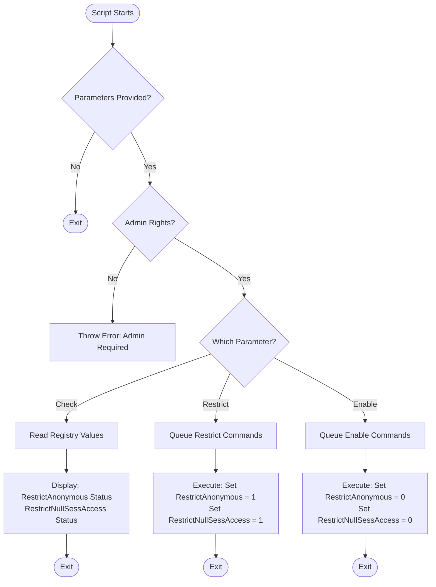

# Set-NullSessions

## Description

`Set-NullSessions.ps1` is a PowerShell script designed to manage null session settings on Windows systems. It provides functionality to enable or restrict null sessions and anonymous access, as well as to check the current status of these settings.

## Workflow



## Key Features

- **Restrict/Enable Anonymous Access**: Allows restricting or enabling anonymous access.
- **Restrict/Enable Null Session Access**: Provides options to restrict or enable null session access.
- **Check Status**: Check the current null session and anonymous access status without making any changes.
- **Logging**: Comprehensive logging of all operations for auditing and troubleshooting.
- **Error Handling**: Robust error handling and informative error messages.
- **Command Pattern**: Utilizes the Command design pattern for flexible and extensible null session management operations.

## Usage

The script supports the following parameters:

- `-RestrictAnonymous`: Enables restriction of anonymous access.
- `-RestrictNullSessionAccess`: Enables restriction of null session access.
- `-EnableNullSessionAccess`: Enables null session access.
- `-EnableAnonymous`: Enables anonymous access.
- `-Check`: Checks the current null session and anonymous access status without making any changes.

## Example
```
.\Set-NullSessions.ps1 -Check

To address the vulnerability CVE-2002-1117 run:
.\Set-NullSessions.ps1 -RestrictAnonymous -RestrictNullSessionAccess

To enable null session access and anonymous access run:
.\Set-NullSessions.ps1 -EnableNullSessionAccess -EnableAnonymous
```

## Requirements

- Windows PowerShell 5.1 or later
- Administrative privileges

## Troubleshooting

If you receive an error that an execution policy has prevented the script from running, run the following command:

```powershell
Set-ExecutionPolicy -Scope Process -ExecutionPolicy Bypass
```

## Security Note

This script is designed to enhance system security by managing null session and anonymous access settings. Always use caution when modifying system settings and ensure you have proper authorization before running this script in a production environment.

## CIS Control

This script helps address CIS Control 9: Limitation and Control of Network Ports, Protocols, and Services. Specifically, it aids in implementing the following sub-controls:

- 9.2: Ensure Only Necessary Ports, Protocols, and Services Are Running
- 9.4: Apply Host-Based Firewalls or Port Filtering

By managing null session and anonymous access settings, this script contributes to reducing the attack surface and improving the overall security posture of Windows systems in alignment with CIS best practices.
