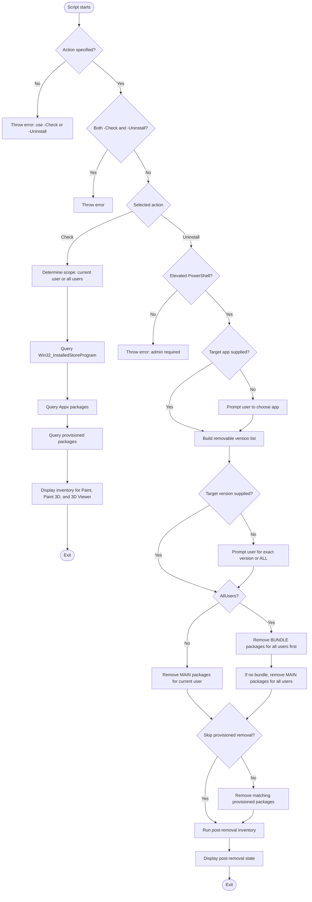

# Set-Paint3d

> **Note on naming**  
> The project is still called `Set-Paint3d` for compatibility with existing automation and repository history.  
> The script now manages a broader set of **Microsoft Paint-family Microsoft Store apps**:
> - **Microsoft Paint** (`Microsoft.Paint`)
> - **Paint 3D** (`Microsoft.MSPaint`)
> - **3D Viewer** (`Microsoft.Microsoft3DViewer`)

> **Important notices**
> - **Paint 3D** was deprecated in August 2024 and removed from the Microsoft Store on **November 4, 2024**. Existing installations continue to work, but new downloads are no longer available.
> - **3D Viewer** was deprecated in February 2026 and will be removed from the Microsoft Store on **July 1, 2026**. Existing installations continue to work until then and can still be reinstalled from the Store before that date.

## Description

`Set-Paint3d.ps1` is a PowerShell script for **inventory and removal** of Microsoft Paint-family Store apps on Windows 10/11.

The script now focuses on **discovery and uninstall workflows**, not update/install workflows. It uses:

- **`Win32_InstalledStoreProgram`** for scanner-aligned Store app inventory
- **`Get-AppxPackage` / `Remove-AppxPackage`** for installed packages
- **`Get-AppxProvisionedPackage` / `Remove-AppxProvisionedPackage`** for provisioned packages

This makes it useful for remediation workflows where a scanner or internal policy requires **removal of a Store app** rather than in-place updating.

---

## Workflow



---

## Key Features

- **Multi-app support**
  - Microsoft Paint (`Microsoft.Paint`)
  - Paint 3D (`Microsoft.MSPaint`)
  - 3D Viewer (`Microsoft.Microsoft3DViewer`)

- **Scanner-aligned inventory**
  - Uses `Win32_InstalledStoreProgram` so the check output is closer to what authenticated vulnerability scanners often see.

- **Interactive uninstall selection**
  - Prompts for the target app when `-TargetApp` is not supplied
  - Prompts for the exact installed version to remove when `-TargetVersion` is not supplied
  - Supports `ALL` to remove every removable version of the selected app

- **Current-user and all-user cleanup**
  - Current-user mode removes installed **MAIN** packages for the current user
  - `-AllUsers` mode removes installed packages for all users and can also remove matching **provisioned** packages from the online Windows image

- **Bundle-aware removal**
  - In `-AllUsers` mode, the script attempts to remove **BUNDLE** packages first, then falls back to **MAIN** packages when necessary

- **Provisioned package cleanup**
  - Removes provisioned packages during `-Uninstall -AllUsers` unless `-SkipProvisionedRemoval` is used

- **Detailed logging**
  - Timestamped log output for inventory, prompts, removal actions, and post-removal verification

- **WhatIf support**
  - Supports PowerShell `-WhatIf` for safe preview of uninstall actions

---

## Usage

| Parameter | Description |
|-----------|-------------|
| `-Check` | Displays inventory for Microsoft Paint, Paint 3D, and 3D Viewer using WMI, Appx, and provisioned-package views. |
| `-Uninstall` | Removes the selected app and version. Requires admin rights. |
| `-AllUsers` | Uses all-user inventory/removal where supported. During uninstall, also removes matching provisioned packages unless `-SkipProvisionedRemoval` is used. |
| `-TargetApp` | Optional non-interactive target. Valid values: `Paint`, `Paint3D`, `3DViewer`. |
| `-TargetVersion` | Optional non-interactive target version. Use an exact installed version such as `11.2601.401.0`, or `ALL`. |
| `-SkipProvisionedRemoval` | Skips `Remove-AppxProvisionedPackage` during `-Uninstall -AllUsers`. |
| `-WhatIf` | Shows what would be removed without making changes. |

---

## Examples

```powershell
# Check inventory for the current user
.\Set-Paint3d.ps1 -Check

# Check inventory across all users
.\Set-Paint3d.ps1 -Check -AllUsers

# Interactive uninstall for the current system scope
.\Set-Paint3d.ps1 -Uninstall

# Interactive uninstall for all users
.\Set-Paint3d.ps1 -Uninstall -AllUsers

# Remove all removable versions of Microsoft Paint for all users
.\Set-Paint3d.ps1 -Uninstall -AllUsers -TargetApp Paint -TargetVersion ALL

# Remove a specific Paint 3D version for all users
.\Set-Paint3d.ps1 -Uninstall -AllUsers -TargetApp Paint3D -TargetVersion "6.2305.16087.0"

# Preview removal of all 3D Viewer versions for all users
.\Set-Paint3d.ps1 -Uninstall -AllUsers -TargetApp 3DViewer -TargetVersion ALL -WhatIf

# Remove installed packages for all users but keep provisioned packages
.\Set-Paint3d.ps1 -Uninstall -AllUsers -TargetApp Paint -TargetVersion ALL -SkipProvisionedRemoval
```

---

## Example Output

### Check operation

```text
[2026-04-10 14:09:25] [Info] === Microsoft Paint-family App Manager ===
[2026-04-10 14:09:25] [Info] Scope: Current user

[2026-04-10 14:09:25] [Info] === Microsoft Paint ===
[2026-04-10 14:09:25] [Info] Detected versions: 11.2601.401.0
[2026-04-10 14:09:25] [Info] Scanner view (Win32_InstalledStoreProgram):
[2026-04-10 14:09:25] [Info]   - Name='Microsoft.Paint'; ProgramId='Microsoft.Paint_11.2601.401.0_x64__8wekyb3d8bbwe'; Version='11.2601.401.0'
[2026-04-10 14:09:25] [Info] Installed MAIN packages:
[2026-04-10 14:09:25] [Info]   - Microsoft.Paint_11.2601.401.0_x64__8wekyb3d8bbwe
[2026-04-10 14:09:25] [Info] Installed BUNDLE packages:
[2026-04-10 14:09:25] [Info]   - None
[2026-04-10 14:09:25] [Info] Provisioned packages:
[2026-04-10 14:09:25] [Info]   - Microsoft.Paint_11.2601.401.0_neutral_~_8wekyb3d8bbwe
[2026-04-10 14:09:25] [Info] Removable versions in this mode: 11.2601.401.0

[2026-04-10 14:09:25] [Info] === Paint 3D ===
[2026-04-10 14:09:25] [Info] Detected versions: none
[2026-04-10 14:09:25] [Info] Scanner view (Win32_InstalledStoreProgram):
[2026-04-10 14:09:25] [Info]   - Not detected
[2026-04-10 14:09:25] [Info] Installed MAIN packages:
[2026-04-10 14:09:25] [Info]   - None
[2026-04-10 14:09:25] [Info] Installed BUNDLE packages:
[2026-04-10 14:09:25] [Info]   - None
[2026-04-10 14:09:25] [Info] Provisioned packages:
[2026-04-10 14:09:25] [Info]   - None
[2026-04-10 14:09:25] [Info] Removable versions in this mode: none
```

### Interactive uninstall

```text
[2026-04-10 14:30:00] [Info] === Microsoft Paint-family App Manager ===
[2026-04-10 14:30:00] [Info] Scope: All users

Select the Paint-family app to remove:
[1] Microsoft Paint  (versions: 11.2601.401.0)
[2] Paint 3D         (versions: 6.2305.16087.0)

Enter a number from 1 to 2: 1

Removable versions for Microsoft Paint:
[1] 11.2601.401.0
[A] ALL versions

Enter the version of Microsoft Paint you want to remove (number, exact version, or A): A

[2026-04-10 14:30:12] [Info] Selected app                 : Microsoft Paint
[2026-04-10 14:30:12] [Info] Selected version             : ALL
[2026-04-10 14:30:12] [Info] Remove provisioned packages  : Yes
[2026-04-10 14:30:13] [Info] Removed installed MAIN package for all users: Microsoft.Paint_11.2601.401.0_x64__8wekyb3d8bbwe
[2026-04-10 14:30:15] [Info] Removed provisioned package: Microsoft.Paint_11.2601.401.0_neutral_~_8wekyb3d8bbwe
```

---

## Technical Details

### Managed application identifiers

| App | Store package name | Notes |
|-----|---------------------|-------|
| Microsoft Paint | `Microsoft.Paint` | Modern Store app. The script does **not** remove classic `mspaint.exe` as a Windows component. |
| Paint 3D | `Microsoft.MSPaint` | Deprecated and removed from the Microsoft Store on November 4, 2024. |
| 3D Viewer | `Microsoft.Microsoft3DViewer` | Deprecated in February 2026 and scheduled for Store removal on July 1, 2026. |

### Discovery and removal methods

The script combines three different views:

1. **Scanner view**  
   `Get-CimInstance Win32_InstalledStoreProgram`

2. **Installed package view**  
   `Get-AppxPackage` using:
   - `-PackageTypeFilter Main`
   - `-PackageTypeFilter Bundle` (primarily for `-AllUsers` removal)

3. **Provisioned package view**  
   `Get-AppxProvisionedPackage -Online`

### Why bundle-first removal matters

When `Remove-AppxPackage -AllUsers` is used, removal works from the **parent package type**. If the app is installed as a bundle, the bundle should be targeted first. The script follows that pattern automatically in `-AllUsers` mode.

---

## Administrator Rights Requirements

| Operation | Admin required | Notes |
|-----------|----------------|-------|
| `-Check` | No | Current-user inventory works without elevation. |
| `-Check -AllUsers` | Recommended | Complete all-user Appx inventory requires elevation. Without admin rights, results may be partial. |
| `-Uninstall` | Yes | The script requires an elevated PowerShell session for all uninstall operations. |
| `-Uninstall -AllUsers` | Yes | Required for all-user removal and provisioned-package cleanup. |

---

## Requirements

- **Windows 10/11**
- **PowerShell 5.1 or later**
- **Administrative privileges** for `-Uninstall`
- Appx/DISM cmdlets available in the local Windows image

---

## Verification Commands

Use these commands to verify what remains after uninstall.

### Microsoft Paint

```powershell
Get-AppxPackage -AllUsers -PackageTypeFilter Main,Bundle -Name Microsoft.Paint |
    Format-List PackageFullName, PackageUserInformation

Get-AppxProvisionedPackage -Online |
    Where-Object DisplayName -eq 'Microsoft.Paint' |
    Select-Object DisplayName, Version, PackageName

Get-CimInstance Win32_InstalledStoreProgram |
    Where-Object { $_.ProgramId -like 'Microsoft.Paint*' } |
    Select-Object Name, ProgramId, Version
```

### Paint 3D

```powershell
Get-AppxPackage -AllUsers -PackageTypeFilter Main,Bundle -Name Microsoft.MSPaint |
    Format-List PackageFullName, PackageUserInformation

Get-AppxProvisionedPackage -Online |
    Where-Object DisplayName -eq 'Microsoft.MSPaint' |
    Select-Object DisplayName, Version, PackageName

Get-CimInstance Win32_InstalledStoreProgram |
    Where-Object { $_.ProgramId -like 'Microsoft.MSPaint*' } |
    Select-Object Name, ProgramId, Version
```

### 3D Viewer

```powershell
Get-AppxPackage -AllUsers -PackageTypeFilter Main,Bundle -Name Microsoft.Microsoft3DViewer |
    Format-List PackageFullName, PackageUserInformation

Get-AppxProvisionedPackage -Online |
    Where-Object DisplayName -eq 'Microsoft.Microsoft3DViewer' |
    Select-Object DisplayName, Version, PackageName

Get-CimInstance Win32_InstalledStoreProgram |
    Where-Object { $_.ProgramId -like 'Microsoft.Microsoft3DViewer*' } |
    Select-Object Name, ProgramId, Version
```

---

## Troubleshooting

### `-Uninstall` says "No removable packages were found"

This usually means one of these is true:

- The package is already removed for the **current user**
- The package still exists for **another user profile**
- Only the **provisioned package** remains in the Windows image

Try:

```powershell
.\Set-Paint3d.ps1 -Check -AllUsers
```

Then, if appropriate:

```powershell
.\Set-Paint3d.ps1 -Uninstall -AllUsers
```

### WMI/scanner view still shows the app after current-user removal

`Win32_InstalledStoreProgram` can still show the app when:

- another user profile still has it installed, or
- inventory has not refreshed yet

Use `-Check -AllUsers` and the verification commands above to confirm whether the package still exists in another profile.

### Provisioned package still appears after uninstall

Current-user uninstall does **not** remove provisioned packages. To remove the app from the online image so it is not provisioned for future users, run:

```powershell
.\Set-Paint3d.ps1 -Uninstall -AllUsers
```

If you intentionally want to keep provisioned packages, use `-SkipProvisionedRemoval`.

### Exact version is rejected

`-TargetVersion` must match one of the **removable versions** shown by the script for the selected scope. Use `-Check` first if you are unsure.

### Execution policy error

If PowerShell blocks the script, run:

```powershell
Set-ExecutionPolicy -Scope Process -ExecutionPolicy Bypass
```

### Classic `mspaint.exe` is still present

That is expected. The script manages **Store app packages** only. It does **not** remove the legacy Windows component at:

```text
C:\Windows\System32\mspaint.exe
```

---

## Notes

- The script now focuses on **inventory and removal**, not install/update workflows
- `-Check` is a discovery action only; it does **not** apply a safe-version baseline or vulnerability score
- The script is designed for cases where the remediation action is **remove the app**
- `-WhatIf` is supported for uninstall preview
- The script name remains `Set-Paint3d` even though the scope is broader

---

## Security Considerations

This script changes application state and can affect the software inventory seen by users, administrators, and vulnerability scanners.

Before using it in production:

- Review the script contents
- Validate app removal against organisational policy
- Test on a non-production system first
- Confirm post-removal state with both Appx commands and `Win32_InstalledStoreProgram`
- Document whether you want to remove only installed packages or also provisioned packages

---

## Related CIS Controls

This script supports software inventory and application control practices aligned with:

- **CIS Control 2: Inventory and Control of Software Assets**
  - 2.3: Utilize software inventory tools
  - 2.4: Track and report unauthorized software

- **CIS Control 4: Secure Configuration of Enterprise Assets and Software**
  - 4.1: Establish and maintain a secure configuration process

---

## License

This script is provided **as-is** without warranty.  
Use it at your own risk and validate in a non-production environment before deployment.

---

## Version History

- **2.0.0** (2026-04-10)
  - Expanded scope from Paint 3D only to Microsoft Paint, Paint 3D, and 3D Viewer
  - Removed legacy update/install workflow documentation
  - Added scanner-aligned `Win32_InstalledStoreProgram` inventory
  - Added interactive app and version prompts for uninstall
  - Added all-user removal guidance for MAIN, BUNDLE, and provisioned packages
  - Retained the `Set-Paint3d` project name for compatibility

- **1.0.0**
  - Original Paint 3D-only workflow
