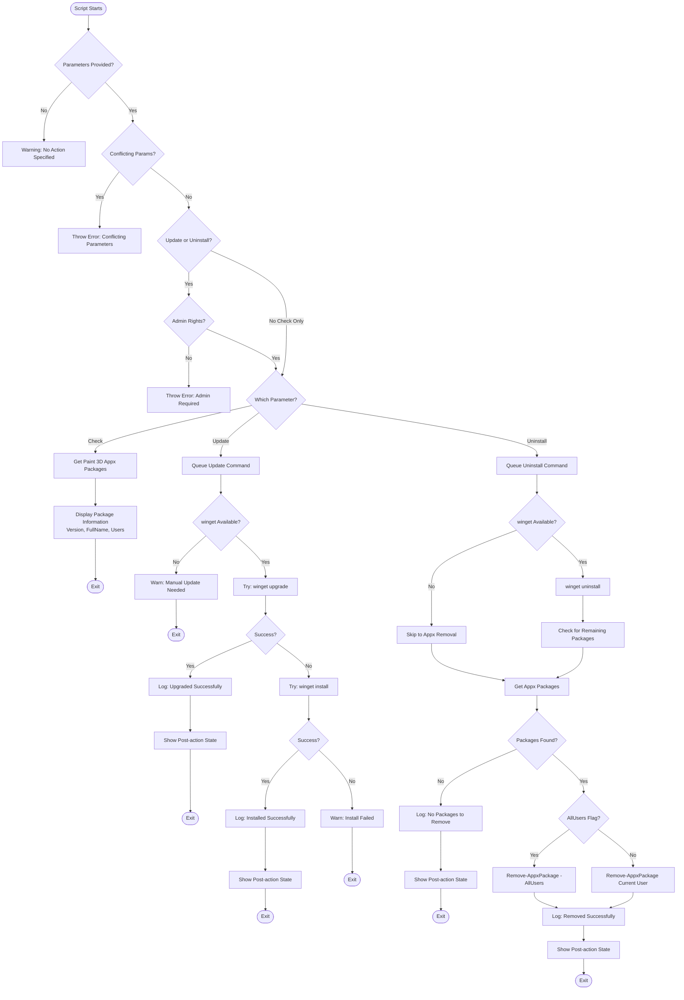

# Set-Paint3d

> **⚠️ IMPORTANT NOTICE**  
> **Microsoft discontinued Paint 3D on November 4, 2024**, and removed it from the Microsoft Store.  
> **New installations are no longer possible.**  
> 
> This script can still manage existing Paint 3D installations:
> - ✅ Check installation status
> - ✅ Uninstall existing installations
> - ⚠️ Update functionality limited to existing installations (no new installs)
> 
> **Alternatives**: Consider using the updated Microsoft Paint (with new features like layers) or other 3D modeling software.

## Description

`Set-Paint3d.ps1` is a PowerShell script that manages Microsoft Paint 3D (Microsoft.MSPaint) installations. This script provides a unified interface to check the installation status, verify existing installations, or completely uninstall Paint 3D from Windows 10/11 systems.

The script leverages Windows Package Manager (winget) for update checks and uninstallation, with fallback to native Appx package management for comprehensive uninstallation support.

## Workflow



---

## Key Features

- **Enhanced Status Checking**  
  View comprehensive Paint application status including:
  - **Paint / Classic Paint** - Detects both modern Store app (Microsoft.Paint) and legacy System32 version
  - **Paint 3D** (Microsoft.MSPaint) - package version and installation scope
  - **Vulnerability Detection** - compares Paint 3D version against safe baseline (default: 6.2305.16087.0)
  - Structured output with computer name, version info, and vulnerability status
  - Multiple detection methods: Store app → System32 → PATH lookup

- **Update Management** ⚠️  
  Check for updates to existing Paint 3D installations. Note: Paint 3D was discontinued on November 4, 2024, so new installations are not possible and updates are unlikely.

- **Complete Uninstallation**  
  Remove Paint 3D using winget first, then fall back to Appx package removal for thorough cleanup.

- **Discontinuation Awareness**  
  Provides clear messaging about Paint 3D's discontinuation and suggests alternatives when installation is attempted.

- **All Users Support**  
  Manage installations across all user profiles with the `-AllUsers` switch.

- **Command Pattern Architecture**  
  Implements a clean, extensible command pattern for maintainability and testing.

- **Comprehensive Logging**  
  Detailed logging with timestamps for auditing and troubleshooting.

- **WhatIf Support**  
  Preview changes before applying them using PowerShell's built-in `-WhatIf` parameter.

---

## Usage

| Parameter | Description |
|-----------|-------------|
| `-Check` | Checks Paint and Paint 3D installation status, including vulnerability detection. |
| `-Update` | ⚠️ Checks for updates to existing installations. Note: Paint 3D discontinued Nov 4, 2024. No new installations possible. |
| `-Uninstall` | Uninstalls Paint 3D using winget and Appx package removal. Requires admin rights. |
| `-AllUsers` | Applies operations to all users. **Note:** Requires admin rights for Paint 3D detection with `-Check`. Paint detection works without admin. |
| `-SafePaint3DVersion` | Baseline version for vulnerability checking (default: 6.2305.16087.0). |

### Examples

```powershell
# Check current installation status (includes Classic Paint + Paint 3D vulnerability detection)
.\Set-Paint3d.ps1 -Check

# Check installation status for all users
.\Set-Paint3d.ps1 -Check -AllUsers

# Check with custom safe version baseline for vulnerability detection
.\Set-Paint3d.ps1 -Check -SafePaint3DVersion "6.2305.16087.0"

# Check for updates to existing Paint 3D installation
# Note: Paint 3D discontinued Nov 4, 2024. This will inform you if Paint 3D
# is not installed or check for updates if it's already installed.
.\Set-Paint3d.ps1 -Update

# Uninstall Paint 3D for current user
.\Set-Paint3d.ps1 -Uninstall

# Uninstall Paint 3D for all users
.\Set-Paint3d.ps1 -Uninstall -AllUsers

# Preview uninstall without making changes
.\Set-Paint3d.ps1 -Uninstall -AllUsers -WhatIf
```

### Example Output

**Check Operation (Modern Paint as Store App):**
```
=== Detecting Paint Applications ===
Safe Paint 3D baseline version: 6.2305.16087.0

Classic Paint / Paint:
  Installed : Yes
  Type      : Store App: Microsoft.Paint_11.2509.441.0_x64__8wekyb3d8bbwe
  Version   : 11.2509.441.0

Paint 3D:
  Installed : No

=== Summary ===
ClassicPaintInstalled : True
ClassicPaintVersion   : 11.2509.441.0
Paint3DInstalled      : False
Paint3DVersion        : N/A
Paint3DVulnerable     : False
```

**Check Operation (With Vulnerable Paint 3D):**
```
=== Detecting Paint Applications ===
Safe Paint 3D baseline version: 6.2305.16087.0

Classic Paint / Paint:
  Installed : Yes
  Path      : C:\Windows\System32\mspaint.exe
  Version   : 10.0.26100.1

Paint 3D:
  Installed          : Yes
  Highest Appx Ver.  : 6.2009.30067.0
  PackageFullName    : Microsoft.MSPaint_6.2009.30067.0_x64__8wekyb3d8bbwe
  Vulnerable         : YES (below safe version 6.2305.16087.0)

=== Summary ===
ClassicPaintInstalled : True
ClassicPaintVersion   : 10.0.26100.1
Paint3DInstalled      : True
Paint3DVersion        : 6.2009.30067.0
Paint3DVulnerable     : True
```

---

## Technical Details

### Application Identifiers

**Paint (Modern/Classic):**
- **Appx Package Name** (Windows 11+): `Microsoft.Paint`
- **Legacy Path** (Windows 10): `C:\Windows\System32\mspaint.exe`
- **Store App Path**: `%LOCALAPPDATA%\Microsoft\WindowsApps\mspaint.exe`

**Paint 3D:**
- **Appx Package Name**: `Microsoft.MSPaint`
- **Store ID**: `9NBLGGH5FV99` (discontinued as of Nov 4, 2024)

### Registry and Package Locations

Paint applications are managed through:
- **Modern Paint**: Appx/MSIX package (Microsoft.Paint) via Microsoft Store
- **Paint 3D**: Appx/MSIX package (Microsoft.MSPaint) - discontinued
- Windows Package Manager (winget) for installation/updates
- Windows Appx cmdlets for package enumeration and removal

### Administrator Rights Requirements

| Operation | Admin Required | Notes |
|-----------|----------------|-------|
| `-Check` (current user) | ❌ No | Full detection works for both Paint and Paint 3D |
| `-Check -AllUsers` | ⚠️ Partial | Paint detection works; Paint 3D needs admin (falls back to current user) |
| `-Update` | ✅ Yes | Required for winget operations |
| `-Uninstall` | ✅ Yes | Required for package removal |

---

## Output Example

### Check Operation

```
[2025-11-26 10:30:15] [Info] === Paint 3D Management Script ===
[2025-11-26 10:30:15] [Info] Scope: Current user
[2025-11-26 10:30:15] [Info] 
[2025-11-26 10:30:15] [Info] Queued: Check current status.
[2025-11-26 10:30:15] [Info] Executing requested operations...
[2025-11-26 10:30:15] [Info] 
[2025-11-26 10:30:15] [Info] Paint 3D is installed. Current installation(s):
[2025-11-26 10:30:15] [Info]   Package: Microsoft.MSPaint_6.1905.29027.0_x64__8wekyb3d8bbwe
[2025-11-26 10:30:15] [Info]   Version: 6.1905.29027.0
[2025-11-26 10:30:15] [Info] 
[2025-11-26 10:30:15] [Info] Finished.
```

### Update Operation

```
[2025-11-26 10:32:45] [Info] === Paint 3D Management Script ===
[2025-11-26 10:32:45] [Info] Scope: Current user
[2025-11-26 10:32:45] [Info] 
[2025-11-26 10:32:45] [Info] Queued: Update Paint 3D.
[2025-11-26 10:32:45] [Info] Executing requested operations...
[2025-11-26 10:32:45] [Info] 
[2025-11-26 10:32:45] [Info] Attempting to upgrade Paint 3D with winget...
[2025-11-26 10:32:52] [Info] Paint 3D upgraded successfully.
[2025-11-26 10:32:52] [Info] 
[2025-11-26 10:32:52] [Info] Changes applied successfully.
[2025-11-26 10:32:52] [Info] 
[2025-11-26 10:32:52] [Info] === Post-action state ===
[2025-11-26 10:32:52] [Info] Paint 3D is installed. Current installation(s):
[2025-11-26 10:32:52] [Info]   Package: Microsoft.MSPaint_6.2103.30017.0_x64__8wekyb3d8bbwe
[2025-11-26 10:32:52] [Info]   Version: 6.2103.30017.0
[2025-11-26 10:32:52] [Info] 
[2025-11-26 10:32:52] [Info] Finished.
```

### Uninstall Operation

```
[2025-11-26 10:35:20] [Info] === Paint 3D Management Script ===
[2025-11-26 10:35:20] [Info] Scope: All users
[2025-11-26 10:35:20] [Info] 
[2025-11-26 10:35:20] [Info] Queued: Uninstall Paint 3D.
[2025-11-26 10:35:20] [Info] Executing requested operations...
[2025-11-26 10:35:20] [Info] 
[2025-11-26 10:35:20] [Info] Attempting to uninstall Paint 3D via winget...
[2025-11-26 10:35:25] [Info] Paint 3D uninstalled via winget.
[2025-11-26 10:35:25] [Info] Removing Appx package(s) Microsoft.MSPaint...
[2025-11-26 10:35:26] [Info] Removed package for all users: Microsoft.MSPaint_6.2103.30017.0_x64__8wekyb3d8bbwe
[2025-11-26 10:35:26] [Info] 
[2025-11-26 10:35:26] [Info] Changes applied successfully.
[2025-11-26 10:35:26] [Info] 
[2025-11-26 10:35:26] [Info] === Post-action state ===
[2025-11-26 10:35:26] [Info] Paint 3D (Microsoft.MSPaint) is NOT installed.
[2025-11-26 10:35:26] [Info] 
[2025-11-26 10:35:26] [Info] Finished.
```

---

## Requirements

* **Windows 10/11**
* **PowerShell 5.1 or later**
* **Administrative privileges** (for Update and Uninstall operations)
* **Windows Package Manager (winget)** (recommended for Update operations)

---

## Testing

The script includes comprehensive Pester tests in `Set-Paint3d.Tests.ps1`.

To run the tests:

```powershell
# Install Pester if not already installed
Install-Module -Name Pester -Force -SkipPublisherCheck

# Run tests
Invoke-Pester -Path .\Set-Paint3d.Tests.ps1
```

---

## Troubleshooting

### Execution Policy Error

If you receive an error about execution policy:

```powershell
Set-ExecutionPolicy -Scope Process -ExecutionPolicy Bypass
```

### winget Not Available

If winget is not available:
- For Windows 10: Install [App Installer](https://www.microsoft.com/p/app-installer/9nblggh4nns1) from Microsoft Store
- For Windows 11: winget is pre-installed; ensure Windows is up to date

### Administrative Privileges

Update and Uninstall operations require administrative privileges. Right-click PowerShell and select "Run as Administrator".

### Paint 3D Already Removed

If Paint 3D has been removed via Windows Settings or Group Policy:
- The script will detect no installed packages
- No errors will be thrown
- The script will report "NOT installed"

---

## Notes

- **Check** operations do not require administrative privileges
- **Update** and **Uninstall** operations require administrative privileges
- The script uses command pattern design for extensibility
- Supports PowerShell's `-WhatIf` parameter for safe testing
- Works with both current user and all users scenarios

---

## Security Considerations

This script manages application installation and removal, which can affect system security posture:

- Always review the script before running in production environments
- Test in non-production environments first
- Verify that Paint 3D removal aligns with organisational policies
- Consider Group Policy management for enterprise deployments
- Monitor Windows Event Logs for package installation/removal events

---

## Related CIS Controls

This script supports application management practices aligned with:

* **CIS Control 2: Inventory and Control of Software Assets**
  * 2.3: Utilize software inventory tools
  * 2.4: Track and report unauthorised software

* **CIS Control 4: Secure Configuration of Enterprise Assets and Software**
  * 4.1: Establish and maintain a secure configuration process
  * 4.7: Manage default accounts on enterprise assets and software

---

## License

This script is provided **as-is** without warranty.  
Use at your own risk and verify in a non-production environment before deployment.

---

## Version History

- **1.0.0** (2025-11-26) - Initial release
  - Check installation status
  - Update/install via winget
  - Uninstall with AllUsers support
  - Command pattern implementation
  - Comprehensive Pester tests
