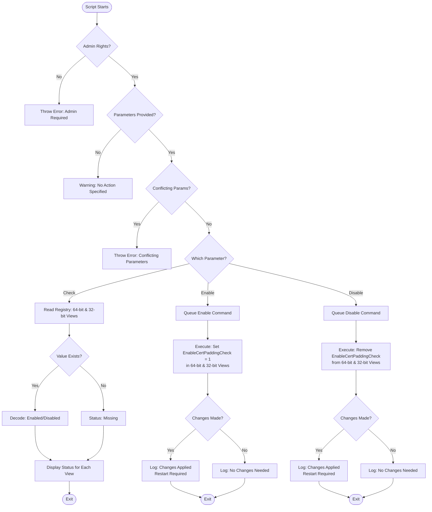

# Set-WinVerifyTrust

## Description

`Set-WinVerifyTrust.ps1` is a PowerShell script that configures the **EnableCertPaddingCheck** registry value to mitigate [CVE-2013-3900](https://msrc.microsoft.com/update-guide/vulnerability/CVE-2013-3900).  
This setting enforces stricter Authenticode signature validation, preventing attackers from exploiting extra padding within signed binaries.

The script provides options to **enable**, **disable**, or **check** the current mitigation state for both 64-bit and 32-bit registry locations.

## Workflow



---

## Key Features

- **Enable / Disable Mitigation**  
  Easily enable or disable the `EnableCertPaddingCheck` registry key in both 32-bit and 64-bit registry paths.

- **Check Status**  
  View the current status of the mitigation without making changes.

- **Accurate Registry Handling**  
  Uses .NET registry APIs to ensure consistent behavior regardless of PowerShell host bitness.

- **Logging & Error Handling**  
  Detailed logging and clear error messages for auditability and troubleshooting.

- **Command Pattern Architecture**  
  Implements a clean, extensible structure for registry operations.

---

## Usage

| Parameter | Description |
|------------|-------------|
| `-Check`   | Checks the current status of `EnableCertPaddingCheck`. |
| `-Enable`  | Enables the mitigation by setting `EnableCertPaddingCheck` to `1` (REG_DWORD). |
| `-Disable` | Disables the mitigation by removing the registry value. |

### Examples

```powershell
# Enable the mitigation
.\Set-WinVerifyTrust.ps1 -Enable

# Check current status
.\Set-WinVerifyTrust.ps1 -Check

# Disable the mitigation
.\Set-WinVerifyTrust.ps1 -Disable
````

---

## Output Example

```
[2025-11-04 10:41:27] [Info] Registry64 -> HKLM:\Software\Microsoft\Cryptography\Wintrust\Config: Enabled (Value=1; Type=DWord)
[2025-11-04 10:41:27] [Info] Registry32 -> HKLM:\Software\Wow6432Node\Microsoft\Cryptography\Wintrust\Config: Enabled (Value=1; Type=DWord)
WARNING: [2025-11-04 10:41:27] [Warning] A system restart is required for changes to take effect.
```

---

## Requirements

* **Windows PowerShell 5.1 or later**
* **Administrative privileges**
* **System restart** after enabling or disabling for the mitigation to take effect

## Troubleshooting

If you receive an error that an execution policy has prevented the script from running, run the following command:

```powershell
Set-ExecutionPolicy -Scope Process -ExecutionPolicy Bypass
```

---

## Security Note

This script directly manages Windows Authenticode verification behavior by setting `EnableCertPaddingCheck`.
Enabling this key strengthens code-signing validation but may cause older or improperly signed binaries to appear **unsigned**.

Before widespread deployment:

* Test in a controlled environment.
* Ensure your signed applications are compliant with modern Authenticode standards.

Microsoft reference:
[CVE-2013-3900 | WinVerifyTrust Signature Validation Vulnerability](https://msrc.microsoft.com/update-guide/vulnerability/CVE-2013-3900)

---

## Related Security Frameworks

While not a direct CIS control, this script supports broader **secure configuration management** practices aligned with:

* **CIS Control 4: Secure Configuration of Enterprise Assets and Software**

  * 4.1: Establish and maintain a secure configuration process
  * 4.2: Establish and maintain secure configuration settings for endpoints

By ensuring stricter signature verification, this script helps **reduce the risk of executing tampered or untrusted code**, improving system integrity and compliance posture.

---

## License

This script is provided **as-is** without warranty.
Use at your own risk and verify in a non-production environment before deployment.

